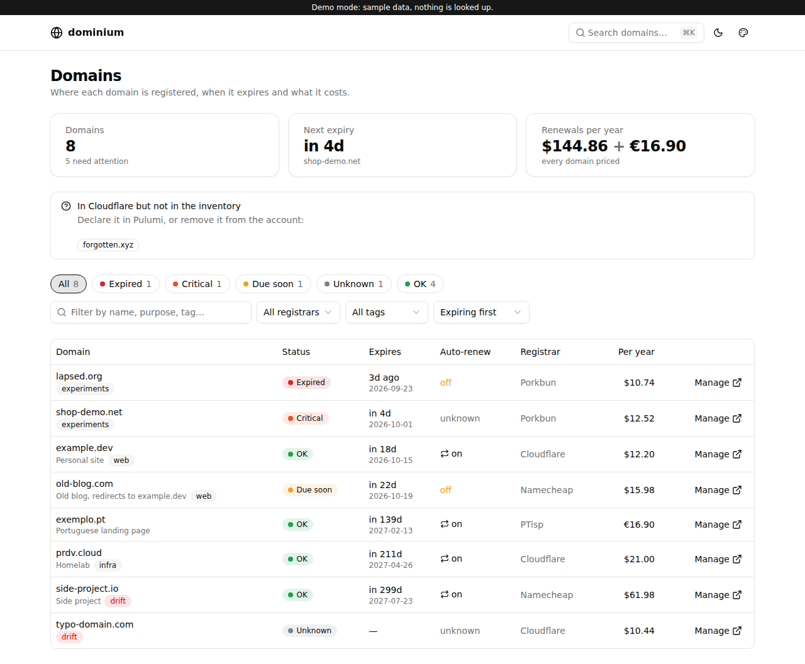
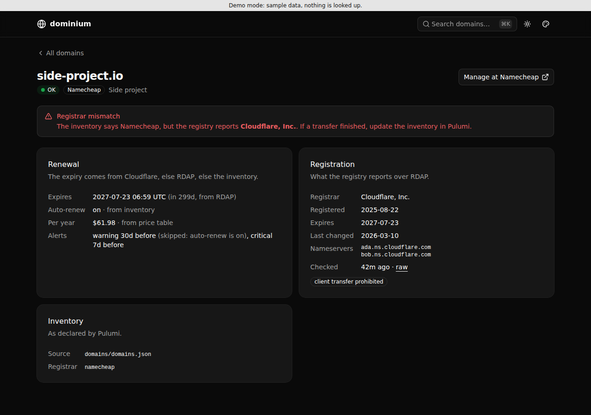
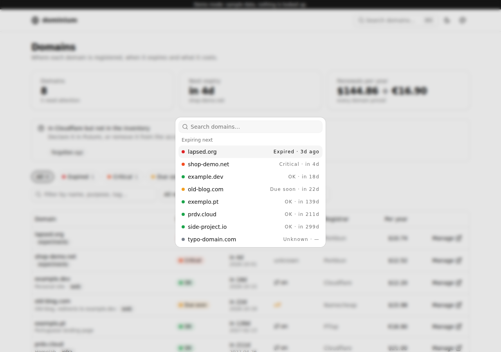

# dominium

A self-hosted, Kubernetes-native inventory of domains: where each one is
registered, when it expires, whether it renews on its own and what the renewal
costs. It exports Prometheus metrics, so expiry alerts arrive through
Alertmanager like everything else.

The list of domains is not maintained here. It comes from ConfigMaps written by
whatever already manages the domains (in my case a Pulumi program), and the
facts come from the registries over RDAP, plus the Cloudflare Registrar API if
you give it a read-only token. It never changes anything anywhere.

Same stack and look as [you-spin-me](https://github.com/PedDavid/you-spin-me).



| Domain detail (dark mode) | Search (⌘K) |
|---|---|
|  |  |

## How it works

```
Pulumi ──▶ ConfigMap(s) dominium.prdv.cloud/inventory=true ◀── watch ── dominium ──▶ /metrics ──▶ Prometheus ──▶ Alertmanager
                                                                          │
                                           RDAP (public) ◀────────────────┤  expiry, registrar, statuses, nameservers
                            Cloudflare Registrar (optional) ◀─────────────┘  auto-renew, lock, drift
```

- **Inventory from ConfigMaps.** Every ConfigMap with the label in the app's
  namespace is read; every key ending in `.json` is an inventory file. Several
  ConfigMaps are merged (e.g. one per Pulumi stack).
- **Facts from the registries.** Each domain is looked up over RDAP every 12h
  (the server comes from the IANA bootstrap file), one request at a time.
  With a Cloudflare token, the account's Registrar is listed hourly.
- **Nothing persisted.** Caches are in memory. A restart just looks everything
  up again.
- **Precedence.** Expiry: Cloudflare → RDAP → `expiresAt` in the inventory.
  Auto-renew: Cloudflare → `autoRenew` in the inventory. Price: `renewal` in
  the inventory → the registrar's price table in the settings.
- **States.** *Expired*, *Critical* (under 7 days, even with auto-renew on:
  that close, a renewal has failed), *Due soon* (under 30 days, only if
  auto-renew is not known to be on), *Unknown* and *OK*. Both thresholds can be
  changed globally or per domain.
- **Drift.** The registrar RDAP reports is compared with the declared one
  (e.g. a transfer finished but the inventory still says Namecheap). With a
  Cloudflare token, domains declared as Cloudflare but missing from the
  account, and domains in the account but in no inventory, are flagged too.

The design is written up in [docs/PLAN.md](docs/PLAN.md).

## Try it

```sh
cargo run -- --demo        # http://localhost:8080, sample data, no network
```

## The inventory

```yaml
apiVersion: v1
kind: ConfigMap
metadata:
  name: domains
  namespace: dominium
  labels:
    dominium.prdv.cloud/inventory: "true"
data:
  domains.json: |
    {
      "version": 1,
      "domains": [
        { "name": "prdv.cloud", "registrar": "cloudflare", "purpose": "Homelab", "tags": ["infra"] },
        { "name": "exemplo.pt", "registrar": "ptisp", "autoRenew": true, "expiresAt": "2027-02-13",
          "renewal": { "price": 16.90, "currency": "EUR" }, "alerts": { "warnBefore": "45d" } }
      ]
    }
```

| Field | | |
|---|---|---|
| `name` | required | The domain. Lower-cased; IDNs in punycode |
| `registrar` | required | Key into the registrar table: `cloudflare`, `namecheap`, `porkbun`, `ptisp`, or your own |
| `purpose`, `tags`, `notes` | | Shown in the UI; tags can be filtered on |
| `autoRenew` | | What you configured at the registrar. Cloudflare's API wins for Cloudflare domains |
| `renewal` | | `{price, currency}`, overrides the price table |
| `expiresAt` | | `YYYY-MM-DD` or RFC 3339. Fallback when RDAP doesn't answer (some ccTLDs have no RDAP) |
| `alerts` | | `{warnBefore, criticalBefore}`, e.g. `45d` |

Unknown fields, invalid entries and domains declared twice are listed at the
top of the UI and counted in `dominium_inventory_problems`; the rest of the
inventory keeps working.

### From Pulumi (Kotlin)

A sketch; adapt it to how your program models domains. It uses
`kotlinx.serialization` and the Kubernetes provider:

```kotlin
@Serializable
data class DomainEntry(
    val name: String,
    val registrar: String,
    val purpose: String? = null,
    val tags: List<String> = emptyList(),
    val autoRenew: Boolean? = null,
)

@Serializable
data class Inventory(val version: Int = 1, val domains: List<DomainEntry>)

val json = Json { explicitNulls = false }

// `domains` is the list your program already iterates over to create zones and records.
ConfigMap("dominium-inventory", ConfigMapArgs.builder()
    .metadata(ObjectMetaArgs.builder()
        .name("domains")
        .namespace("dominium")
        .labels(mapOf("dominium.prdv.cloud/inventory" to "true"))
        .build())
    .data(mapOf("domains.json" to json.encodeToString(
        Inventory(domains = domains.map { DomainEntry(it.name, it.registrar, it.purpose, it.tags) }))))
    .build())
```

## Install

```sh
helm install dominium deploy/helm/dominium -n dominium --create-namespace \
  -f deploy/examples/values-homelab.yaml
```

Options are documented in [`values.yaml`](deploy/helm/dominium/values.yaml).
The chart installs a single-replica Deployment, a Role that can read
ConfigMaps in the inventory namespace (RBAC can't filter by label, so prefer a
dedicated namespace), and the settings ConfigMap. Optionally: ServiceMonitor,
PrometheusRule, Grafana dashboard and Ingress.

There is no login: everything shown is public data plus your notes and prices.
Put the Ingress behind your forward-auth if you want one.

### Registrars and prices

Registrars are configured under `settings.registrars` and merged into the
built-in ones (`cloudflare`, `namecheap`, `porkbun`, `ptisp`, which only have a
name and a dashboard link). Only set what you want to change:

```yaml
settings:
  registrars:
    cloudflare:
      currency: USD
      prices: { com: 10.44, dev: 12.20 }   # yearly renewal price per TLD
    ptisp:
      currency: EUR
      rdapNames: ["PTisp"]                 # how RDAP names it, for the drift check
      prices: { pt: 16.90 }
  rdap:
    servers: {}                            # TLD → RDAP base URL, for TLDs missing from IANA's list
```

`rdapNames` defaults to the key; matching ignores case and punctuation, so
`namecheap` matches "NameCheap, Inc.".

### Cloudflare (optional)

Create an account API token with read access to the Registrar only, store it
in a Secret and point the chart at it:

```sh
kubectl -n dominium create secret generic dominium-cloudflare --from-literal=token=...
```

```yaml
cloudflare:
  accountId: <account id>
  token:
    existingSecret: dominium-cloudflare
```

Without it, everything works from RDAP and the inventory; auto-renew for
Cloudflare domains then comes from `autoRenew` in the inventory.

## Metrics

Served on `:9090/metrics`, together with `/healthz` and `/readyz`. Per-domain
metrics carry `domain` and `registrar`.

| Metric | Meaning |
|---|---|
| `dominium_domain_expiry_timestamp_seconds` | Effective expiry; alert on this |
| `dominium_domain_auto_renew` | 1 on, 0 off, absent when unknown |
| `dominium_domain_renewal_price{currency}` | Yearly renewal price |
| `dominium_domain_warn_before_seconds`, `…_critical_before_seconds` | Per-domain thresholds |
| `dominium_domain_state_known` | 0 when no source knows the expiry |
| `dominium_domain_registrar_mismatch{rdap_registrar}` | 1 when RDAP names another registrar |
| `dominium_domain_missing_from_cloudflare` | 1 when declared as Cloudflare but not in the account |
| `dominium_domain_last_checked_timestamp_seconds{source}` | Last successful RDAP answer |
| `dominium_domain_info{purpose, source}` | Metadata for joins |
| `dominium_undeclared_domain{domain}` | In the Cloudflare account, in no inventory |
| `dominium_inventory_problems` | Invalid or duplicate inventory entries |
| `dominium_rdap_requests_total{result}`, `dominium_cloudflare_requests_total{result}` | |

The alert rules are in [`files/alerts.yaml`](deploy/helm/dominium/files/alerts.yaml),
with `promtool` unit tests in [`deploy/tests`](deploy/tests/alerts_test.yaml).

## Configuration

Every flag can also be set with an environment variable; see
`dominium --help` for the full list.

| Flag / env | Default | |
|---|---|---|
| `--namespace` / `DOMINIUM_NAMESPACE` | pod namespace | Where the inventory ConfigMaps live |
| `--settings-file` / `DOMINIUM_SETTINGS_FILE` | built-in | Registrars, prices, RDAP servers |
| `--warn-before`, `--critical-before` | `30d`, `7d` | Default thresholds |
| `--rdap-interval` | `12h` | Per-domain RDAP refresh |
| `--rdap-bootstrap-url` | IANA's `dns.json` | |
| `--cloudflare-account-id`, `--cloudflare-token-file` | | Both or neither |
| `--cloudflare-interval` | `1h` | |
| `--demo` | off | Sample data, no Kubernetes or network |

## Development

Same stack as you-spin-me: Rust (axum, kube-rs), askama templates, Tailwind v4
with vendored [Basecoat](https://basecoatui.com) and htmx. No Node.js is needed
at runtime or to build the binary.

```sh
make check        # fmt, clippy, tests
make css          # rebuild assets/dist/app.css (Tailwind standalone CLI)
make helm-lint
make alerts-test  # render the alert rules and run their promtool tests
make visual       # screenshot tests in Chromium (make visual-browsers first)
```

Every page is rendered at a fixed moment (`tests/common/mod.rs`) and checked
two ways:

- **HTML snapshots** (`tests/snapshots.rs`, [insta](https://insta.rs)) run with
  `cargo test`. After an intended markup change, accept it with
  `cargo insta review`.
- **Screenshots** (`tests/visual.rs`,
  [playwright-rs](https://github.com/padamson/playwright-rust)) drive Chromium
  against the router in-process, including dark mode, a palette, a state
  filter and the ⌘K palette, and compare with `tests/screenshots/*.png`. The
  test-only Playwright driver brings its own Node.js. Fonts and antialiasing
  vary between machines, so the baselines are the ones CI's `visual` job
  renders: when it fails, its `screenshots` artifact has each `-actual.png`
  and `-diff.png`. Running the CI workflow by hand with *update screenshots*
  ticked returns a full new set to commit.

## Limitations

- **RDAP coverage.** Some ccTLDs have no RDAP server in IANA's list. Those
  domains need `expiresAt` in the inventory (or an RDAP server in the
  settings), and the date has to be kept up to date by hand.
- **Only Cloudflare's API.** Auto-renew for Namecheap, Porkbun and PTisp comes
  from the inventory, not from the registrar.
- **Prices are maintained by hand** in the settings or the inventory.
- **Single replica.** Caches are per process.
